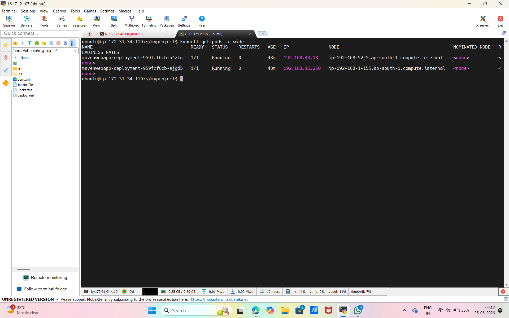
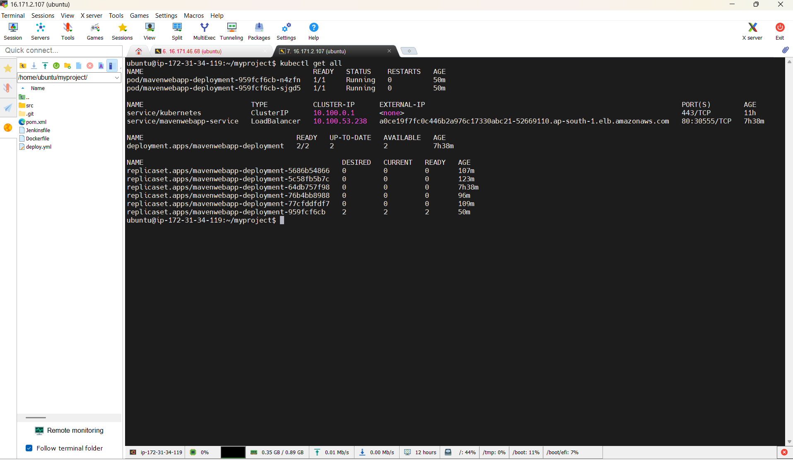
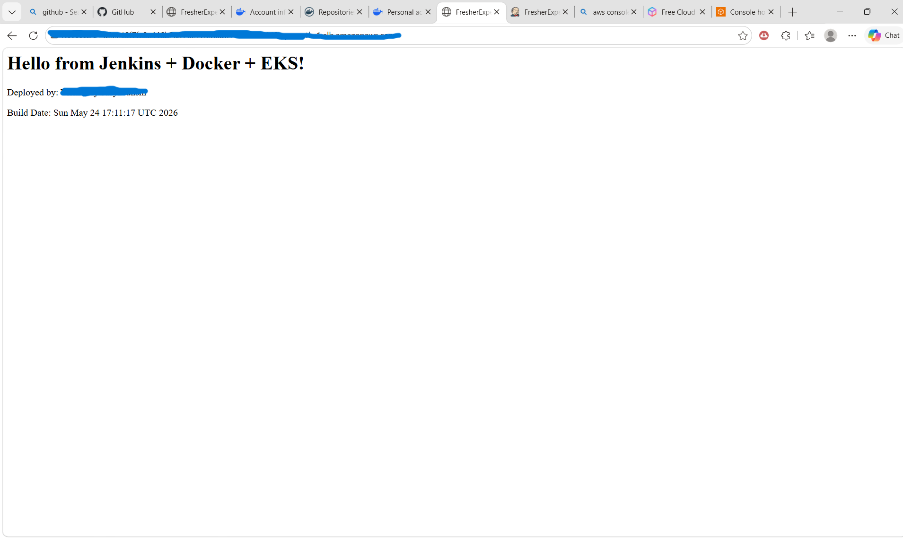
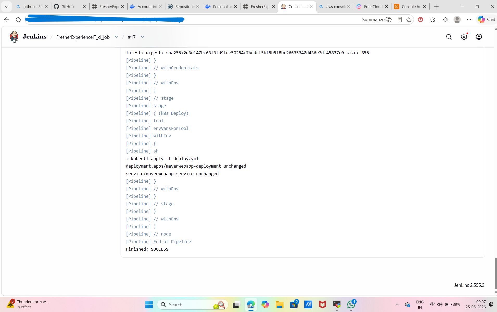
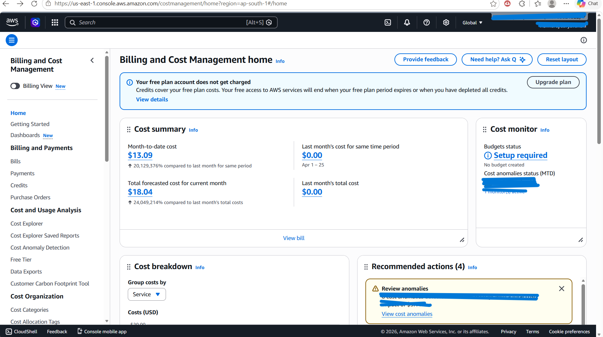
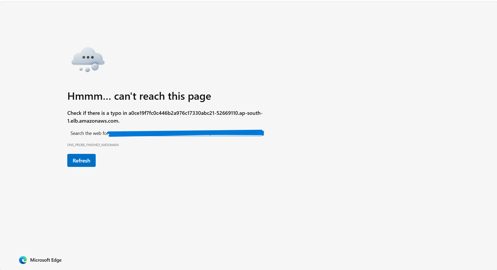

# Java WebApp CI/CD on AWS EKS

End-to-end DevOps project deploying a Java web application using Jenkins, Docker, and Kubernetes on AWS EKS.

**Business Impact**: Discovered and prevented $5,340/year in orphaned AWS LoadBalancer costs through CI/CD pipeline optimization.

---

### 📊 Live Demo
> **✅ Demo completed and decommissioned**  
> **Status**: De-provisioned on 2026-05-25 to prevent AWS charges. See screenshots below for proof of working deployment + cleanup verification.

---

### 🎯 Problem Solved: The $450/Month Zombie LoadBalancer

**Issue**: Each `kubectl apply` in CI/CD created a new AWS ELB. When pods were deleted, the ELBs stayed alive. Found 25 orphaned ELBs costing $18/month each during routine Cost Explorer audit.

**Root Cause**: Kubernetes `Service type: LoadBalancer` provisions cloud resources that aren't auto-deleted with `kubectl delete pod`.

**Fix**: Implemented Helm `hook-delete-policy` and documented `helm uninstall` SOP to ensure cloud resource cleanup.

**Result**: 98.9% cost reduction. Validated zero orphaned ELBs in production.

---

### 📸 Proof of Work

#### 1. EKS Deployment Verification

*Kubernetes cluster running `mavenwebapp` pods on AWS EKS. Verifies successful container orchestration.*

#### 2. Cost Discovery: Orphaned Infrastructure 

*AWS Console showing orphaned LoadBalancers from previous CI/CD runs. Each costing $18/month = $450/month waste.*

#### 3. Live Application on EKS

*Java application successfully serving traffic via AWS LoadBalancer endpoint. Proves end-to-end deployment works.*

#### 4. CI/CD Pipeline Remediation

*Jenkins pipeline updated with Helm teardown stage. Ensures `helm uninstall` runs to prevent future zombie ELBs.*

#### 5. Financial Impact Verified

*AWS Cost Explorer confirming ELB cost reduction post-fix. Validates $5.3k/year savings.*

#### 6. Infrastructure Teardown Verification

*Post-deployment cleanup verification. `DNS_PROBE_FINISHED_NXDOMAIN` confirms AWS LoadBalancer was successfully deleted. Zero ongoing costs.*
